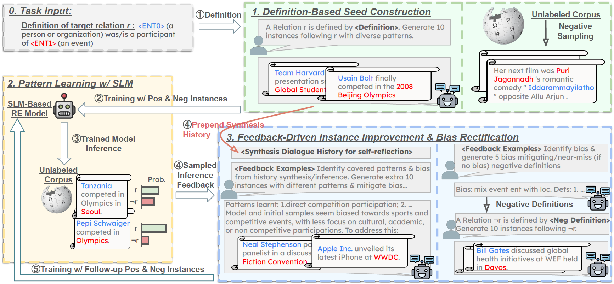

# REPaL

This repository maintains the code and data for [Grasping the Essentials: Tailoring Large Language Models for Zero-Shot Relation Extraction](https://arxiv.org/abs/2402.11142). 


## Links

- [Overview](#overview)
- [Requirements](#requirements)
- [Datasets](#datasets)
- [Definition-Based Seed Construction and First-Round of Pattern Learning w/SLM](#definition-based-seed-construction-and-first-round-of-pattern-learning-wslm)
- [Feedback-Driven Instance Improvement & Bias Rectification](#feedback-driven-instance-improvement--bias-rectification)
- [Citations](#citations)
- [Code Base Structure](#code-base-structure)

## Overview
**REPaL** is a framework to obtain a small language model based relation extractor for any target relation by distilling from a large language model. 
For any target relation (aka positive relation), we only assume the definition/description for that relation and an unlabeled relation instance corpus is given. 
REPaL works by (see the framework in the figure below): (1) synthesizing initial positive instances with the large language model and randomly sample from the unlabeled corpus as initial negative relation instances;
(2) fine-tune a small pre-trained language model with initial instances and conduct inference over the unlabeled corpus; (3) sample instances from the unlabeled corpus as feedback and use previous synthesis history as feedback for follow-up positive instance and negative instance synthesis (first synthesize negative relation definitions and then synthesize follow-up negative instances). 
Note that the more subsequent iterations can be conducted following the above procedure. 
Also note that we also synthesize the dev set data with the same size as train data for automatically picking the checkpoint for the fine-tuned relation extractor. 

For our defined **Definition Only Zero-Shot Relation Extraction Setting**, you will obtain a relation extractor for each relation with given definition. 
To convert it into the mutli-way relation classification setting, you can leverage the synthesized positive instances for a set of positive relations to train a multi-way relation classifier or decompose the multi-way classification task into multiple binary classification tasks (In this paper, we train the [KnowPrompt](https://github.com/zjunlp/KnowPrompt) with our synthesized data).


<p align="center">
  
</p>


## Requirements

The codes are written in Python 3.8. Please first install the required packages by the following command:

```
pip install -r requirements.txt
```


## Datasets

Download data from [datasets](https://drive.google.com/drive/folders/1tGDTPhQ1-oy61lqSv00nJSP84Oai31I5?usp=sharing). 
Extract the `data.tar.gz` file (DefOn-FewRel and DefOn-WikiZSL) by
```
tar -xf data.tar.gz
```
and place the corresponding `data` folder under the current coda base `./`.

Extract the `reproduce_main_data.tar.gz` file (DefOn-FewRel and DefOn-WikiZSL for reproducing the main experiments) by 
```
tar -xf reproduce_main_data.tar.gz
```
and place the corresponding `data` folder under the `./reproduce/main`. 

You can adjust the `--dataset_dir` for running experiments over data in your specified folder. 


## Definition-Based Seed Construction and First-Round of Pattern Learning w/ SLM

```
bash scripts/run_init.sh
```

## Feedback-Driven Instance Improvement & Bias Rectification

```
bash scripts/run.sh
```


## TODO

- [ ] Complete the contents under reproduce folder
- [ ] Further organize the current implementation for more modularized organization

## Citations
Please cite the following paper if you find the code helpful!

```
@inproceedings{zhou-etal-2024-grasping,
    title = "Grasping the Essentials: Tailoring Large Language Models for Zero-Shot Relation Extraction",
    author = "Zhou, Sizhe  and
      Meng, Yu  and
      Jin, Bowen  and
      Han, Jiawei",
    editor = "Al-Onaizan, Yaser  and
      Bansal, Mohit  and
      Chen, Yun-Nung",
    booktitle = "Proceedings of the 2024 Conference on Empirical Methods in Natural Language Processing",
    month = nov,
    year = "2024",
    address = "Miami, Florida, USA",
    publisher = "Association for Computational Linguistics",
    url = "https://aclanthology.org/2024.emnlp-main.747",
    pages = "13462--13486",
    abstract = "Relation extraction (RE) aims to identify semantic relationships between entities within text. Despite considerable advancements, existing models predominantly require extensive annotated training data, which is both costly and labor-intensive to collect. Moreover, these models often struggle to adapt to new or unseen relations. Few-shot learning, aiming to lessen annotation demands, typically provides incomplete and biased supervision for target relations, leading to degraded and unstable performance. To accurately and explicitly describe relation semantics while minimizing annotation demands, we explore the definition only zero-shot RE setting where only relation definitions expressed in natural language are used to train a RE model. We introduce REPaL, comprising three stages: (1) We leverage large language models (LLMs) to generate initial seed instances from relation definitions and an unlabeled corpus. (2) We fine-tune a bidirectional Small Language Model (SLM) with initial seeds to learn relations for the target domain. (3) We expand pattern coverage and mitigate bias from initial seeds by integrating feedback from the SLM{'}s predictions on the unlabeled corpus and the synthesis history. To accomplish this, we leverage the multi-turn conversation ability of LLMs to generate new instances in follow-up dialogues, informed by both the feedback and synthesis history. Studies reveal that definition-oriented seed synthesis enhances pattern coverage whereas indiscriminately increasing seed quantity leads to performance saturation. Experiments on two datasets show REPaL significantly improved cost-effective zero-shot performance by large margins.",
}
```

## Acknowledgements
- Thanks to [BERTNet](https://github.com/tanyuqian/knowledge-harvest-from-lms) regarding the implementation of relation definition bootstraping
- Thanks to OpenAI regarding the implementation of calling api asynchronously


## Code Base Structure
```
$CODE_DIR
├── data
│   ├── fewrel_defon_1
│   ├── fewrel_defon_2
│   ├── fewrel_defon_3
│   ├── fewrel_defon_4
│   ├── fewrel_defon_5
│   ├── wikizsl_defon_1
│   ├── wikizsl_defon_2
│   └── wikizsl_defon_3
├── figures
├── README.md
├── reproduce
│   ├── main
│   │   └── data
│   └── README.md
├── requirements.txt
├── scripts
│   ├── run_init.sh
│   └── run.sh
└── src
    ├── dataloader.py
    ├── __init__.py
    ├── llm_gen.py
    ├── model.py
    ├── pattern_learning.py
    ├── run.py
    ├── trainer.py
    └── utils.py

```